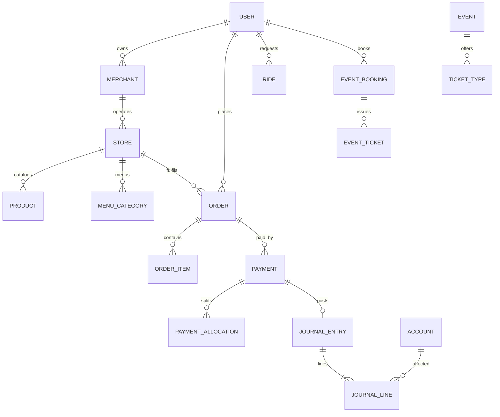

# DalaDrop Database Architecture Review & Redesign

**Status:** Design complete — migration files generated, **not executed**  
**Date:** 2026-07-26  
**Scope:** PostgreSQL + Prisma 5.22 · NestJS Clean Architecture scaffold · UI contracts (`Uidocs/`)  
**Safety:** No `.env` changes · No live SQL · No `prisma migrate` / `db push` execution

---

## 1. Executive summary

This repository is an **enterprise NestJS scaffold** with a fully built framework layer (`core` / `platform` / `shared`) but **no persisted domain model**. `prisma/schema.prisma` contained only a bootstrap `ScaffoldMeta` placeholder. There are no Prisma migrations, no TypeORM entities, and both `schema.sql` stubs are comment-only.

The **real business model** lives in `Uidocs/` (customer app API contracts): multi-vertical commerce (food, local markets, liquor, gas), rides/parcels, events/tickets, M-Pesa payments, favourites, notifications, and pricing config.

**Verdict:** Treat this as a **greenfield production schema authoring** exercise guided by UI contracts and framework conventions—not a refactor of an existing live model.

### Design principles applied

| Principle | Decision |
| --- | --- |
| Source of truth | UI contracts for customer-facing entities; accounting/audit designed for production ops (not in UI) |
| Money | Integer/bigint **minor units** + `CHAR(3)` currency (matches `Money` VO); no floats |
| IDs | UUID v4 (`@db.Uuid`) everywhere except prefixed domain-event ids (`VarChar`) |
| Naming | Prisma camelCase → Postgres `snake_case` plural tables |
| Soft delete | `deletedAt` (+ actor/reason) on mutable entities; **never** on ledgers/journals/audit |
| Orders | Single polymorphic `orders` table with `moduleType` (avoids 4× duplicated financial paths) |
| Vendors | `merchants` + typed `stores` (RESTAURANT / MARKET / LIQUOR / GAS / GENERAL) |
| Geo | Lat/lng columns now + **PostGIS geography** via unsupported columns + GIST (justified) |
| Tenancy | No blanket `tenantId` (scaffold tenancy is runtime-only); ownership via user/merchant FKs + RLS |
| Financials | Full double-entry CoA / journal / wallet / escrow / settlement (append-only) |
| Audit | Entity-level before/after audit (immutable), separate from request/access logs |

### What was delivered in-repo

- Refactored `prisma/schema.prisma`
- Migration SQL under `prisma/migrations/` (**not applied**)
- Validation SQL under `docs/database/validation/`
- This review + ERD + roadmap + checklists

---

## 2. Database architecture review

### Current state findings

| Area | Finding | Severity |
| --- | --- | --- |
| Schema emptiness | Only `scaffold_meta` | Blocker for product |
| Dual ORM | Prisma + TypeORM both wired; no entities | Confusion risk |
| Money | Strong VO, zero persistence mapping | Must standardize columns |
| Soft delete | Framework uses `deletedAt` only | Extend with actor/reason in DB |
| Audit | In-memory request-ish `AuditEvent` | Replace with entity audit |
| Finance | No wallet/ledger/escrow | Must design from scratch |
| Geo | Plain postgres:15, no PostGIS | Gap vs discovery/radius pricing |
| RLS | Not present | Needed for Supabase + multi-party |
| Migrations | Empty TypeORM stub; no Prisma migrations | Must author carefully |
| Indexes | N/A | Design for 10M users / 100M txns |

### Weak modelling (pre-design gaps this schema closes)

1. **Four parallel order shapes** in UI (food/market/liquor/gas) would explode into duplicated payment/settlement logic if mirrored 1:1 as tables.
2. **Merchant vs store vs restaurant** naming collision in contracts — unified as merchant (legal entity) → store (selling point) → catalog.
3. **Customer “delete history”** must not soft-delete financial orders — use `customerHiddenAt` instead.
4. **Payment as status fields on rides/orders** alone is insufficient — need Payment + allocations + ledger postings.
5. **Ratings stored only as aggregates** on stores without review rows loses auditability — add `reviews` with denormalized aggregates updated transactionally.

### Normalisation stance

- **3NF** for transactional entities (users, orders, tickets, journals).
- **Controlled denormalisation** for discovery cards: `ratingAvg`, `reviewCount`, `isOpen` cache, delivery fee **hints** (authoritative fee from quote/pricing).
- **Avoid** over-normalising opening hours into a generic EAV; use `store_opening_hours` rows.

---

## 3. Entity relationship review

### Bounded contexts

```
Identity & Access ──┬── Merchant / Store / Catalog
                    ├── Orders / Checkout
                    ├── Transport (Ride / Rider)
                    ├── Events / Ticketing
                    ├── Payments ──► Ledger / Wallets / Escrow / Settlement
                    ├── Notifications
                    └── Config / Ops / Audit
```

### Cardinality highlights

| Relationship | Cardinality | Notes |
| --- | --- | --- |
| User → Sessions | 1:N | Revocable; hashed refresh tokens |
| User → Merchants (owner) | 1:N | Seller onboarding |
| Merchant → Stores | 1:N | Multi-location |
| Store → Products / Menu | 1:N | Menu only for RESTAURANT |
| Customer → Orders | 1:N | `moduleType` discriminator |
| Order → OrderItems | 1:N | Snapshot prices |
| Order/Ride/Booking → Payments | 1:N | Retries create new payment attempts |
| Payment → JournalEntry | 1:0..1 | Posted when SUCCESS |
| JournalEntry → JournalLines | 1:N (≥2) | Double-entry balanced |
| Event → TicketTypes → Tickets | 1:N:N | Inventory via sold qty + ticket rows |
| User ↔ SavedItems | M:N via junction | Unique `(userId, kind, targetId)` |

### FK action policy

| Parent | Child | On delete | Justification |
| --- | --- | --- | --- |
| User | Orders | RESTRICT | Preserve financial history |
| Store | Products | RESTRICT | Soft-delete store instead |
| Order | Payments | RESTRICT | Immutable money trail |
| Account | JournalLine | RESTRICT | CoA integrity |
| Session | — | CASCADE from user optional | Prefer revoke; hard-delete user anonymises |

---

## 4. UI contract validation

| Contract area | Schema coverage | Gaps / API notes |
| --- | --- | --- |
| Auth / OTP / social | `users`, `user_credentials`, `social_identities`, `otp_challenges`, `sessions` | OTP store is ephemeral-capable (Redis OK); table for audit/replay protection |
| Profile / places / stats | `saved_places`; stats are **computed** (views or query) | `GET /user/me` must be implemented in API |
| Restaurants + menu + modifiers | `stores` (RESTAURANT) + menu_* tables | Discover filters via indexes + PostGIS |
| Markets / liquor / gas | `stores` + `products` + `categories` | `ageRestricted` on store/product; gas `size`/`serviceType` |
| Cart | `carts` / `cart_items` | Deferred in UI — schema ready |
| Checkout quote | Uses pricing config + geo — no persistent quote required | Optional `checkout_quotes` for audit |
| Module orders | Unified `orders` + `order_items` | API still exposes `/food-orders` etc. as views on `moduleType` |
| Payments M-Pesa | `payments` + gateway refs | Status enum aligns SUCCESS/FAILED/PENDING/PROCESSING |
| Rides / parcel | `rides`, `riders`, partners, routes | Parcel is a `serviceType` on ride |
| Events / tickets | Full event domain | Inventory concurrency via version + qty checks |
| Favourites | `menu_favourites` + `saved_items` | Matches dual API |
| Notifications / push | `notifications`, `push_tokens` | mark-read supported via `readAt` |
| Pricing config | `app_pricing_configs` | Versioned JSON + typed columns for critical bands |
| Age verification | `age_verifications` | Status machine + reviewer |
| Legal acceptances | `legal_acceptances` | Append-only |
| Discovery feed | `discovery_sections` + items | Optional CMS |
| Wallets / escrow | Present in schema | **Not** in customer UI — backend/admin only |

---

## 5. Security review

| Control | Recommendation | Justification |
| --- | --- | --- |
| Password storage | `user_credentials.passwordHash` only | Never store plaintext |
| Password history | `password_history` (last N hashes) | Prevent reuse |
| Failed logins | `login_attempts` | Lockout / anomaly detection |
| Sessions | Hash refresh tokens (SHA-256), `revokedAt` | Matches `SessionRecord` |
| Device trust | `devices` + `trustedAt` | Fraud reduction for M-Pesa |
| Token revocation | Session revoke + denylist optional in Redis | DB source of truth for refresh |
| Field encryption | Encrypt national IDs / age-doc URLs at app layer (AES-GCM); store ciphertext | GDPR / KYC |
| Secrets | Stay in vault/env — never DB for gateway keys | Key rotation ops concern |
| RLS | Policies for customer/merchant/rider/admin | Supabase-compatible `auth.uid()` |
| FK hardening | RESTRICT on financial graphs | Prevent accidental cascade wipe |
| PII | Soft-delete + anonymisation job for `DELETE /user/me` | UI expects delete; finance needs retention |

---

## 6. Performance review

### Scale targets

~10M users · ~100M financial lines · millions of orders/rides/tickets/notifications.

### Strategy (not premature micro-optimisation)

1. **UUID v4** trade-off: random IDs fragment B-tree; acceptable at start. Revisit UUID v7 when framework `isUuid` relaxes.
2. **Partition candidates (later):** `journal_lines`, `entity_audit_logs`, `notifications`, `login_attempts` by month (BRIN on `created_at`).
3. **Hot path indexes:** partial indexes `WHERE deleted_at IS NULL`, status+created composites, geo GIST.
4. **Covering indexes** for feed list columns where measured.
5. **Avoid** unbounded `Json` for line items — use `order_items` rows.
6. **Outbox** table for reliable domain events (framework aggregate root already buffers events).

### Index classes used

| Type | Use |
| --- | --- |
| B-tree | PK/FK/status/createdAt |
| Composite | `(store_id, status, created_at)` |
| Partial | Active rows, unpaid orders |
| GIN | JSONB tags/metadata; trigram search later |
| GIST | PostGIS geography |
| BRIN | Append-only time-series (audit, journal) in phase 2 |
| Unique | Natural business keys + soft-delete aware partial uniques |

---

## 7. Financial architecture review

### Why the UI payment model is not enough

UI models payment as status + `checkoutRequestId` + `mpesaRef` on the order/ride. That supports UX but **cannot**:

- Prove double-entry integrity
- Escrow vendor payouts until delivery
- Settle Friday rider batches
- Allocate one M-Pesa payment across fees
- Handle partial refunds / chargebacks
- Reconcile gateway statements

### Proposed ledger design

```
ChartOfAccounts → Account
Payment (gateway attempt)
  → PaymentAllocation (order/ride/booking/fee)
  → JournalEntry (immutable header)
       → JournalLine (debit/credit, balanced)
Wallet (customer/merchant/rider/platform) ↔ WalletTransaction (mirror of postings)
EscrowHold → release/forfeit → journal
SettlementBatch → SettlementItem → journal
Refund / Chargeback → reversing journal
ReconciliationRun → unmatched exceptions
```

### Invariants (enforced in app + SQL checks)

1. Every posted `JournalEntry` has `Σ debit = Σ credit`.
2. Journal entries/lines are **insert-only** (no UPDATE of amounts; reverse via new entry).
3. Money columns are `BIGINT` minor units + `currency`.
4. Wallet balance is derived from transactions; cached balance updated in same UnitOfWork.
5. Escrow release creates settlement-eligible balance, never silent overwrite.

### Chart of accounts (seed sketch)

| Code | Name | Type |
| --- | --- | --- |
| 1000 | Platform Cash (M-Pesa) | ASSET |
| 1100 | Customer Wallets | LIABILITY |
| 1200 | Escrow — Commerce | LIABILITY |
| 1300 | Escrow — Rides | LIABILITY |
| 2000 | Merchant Payables | LIABILITY |
| 2100 | Rider Payables | LIABILITY |
| 4000 | Service Fee Revenue | REVENUE |
| 4100 | Delivery Fee Revenue | REVENUE |
| 5000 | Refunds & Chargebacks | EXPENSE |

---

## 8. Audit architecture review

Replace in-memory `AuditEvent` sink usage for **entity** changes with `entity_audit_logs`:

| Field | Purpose |
| --- | --- |
| action | INSERT/UPDATE/DELETE/RESTORE/SOFT_DELETE/ROLE_CHANGE/PERMISSION_CHANGE/APPROVAL/STATUS_CHANGE |
| entityTable / entityId | Target |
| beforeJson / afterJson | Snapshots |
| changedFields | Array of field names |
| actorId / actorType | Who |
| ip / deviceId / userAgent | Context |
| correlationId / traceId | Observability |
| reason | Human/system reason |
| createdAt | Immutable timestamp |

**No updates/deletes** on this table (REVOKE + app convention). Request/access logs remain a separate observability concern (Winston/ELK), not this table.

---

## 9. Missing capabilities (pre-schema)

- Double-entry accounting, wallets, escrow, settlements, refunds, chargebacks, reconciliation  
- Entity audit with before/after  
- RBAC persistence (roles/permissions tables)  
- Password history / login attempts / devices  
- Server cart  
- Age verification persistence  
- Discovery CMS  
- Domain event outbox  
- Idempotency records  
- Feature flags / maintenance windows  
- Webhook delivery log  
- PostGIS / spatial indexes  
- RLS policies  

---

## 10. Recommended new entities

| Entity | Justification |
| --- | --- |
| `accounts` / `journal_*` | Production finance |
| `wallets` / `wallet_transactions` | Rider/merchant balances |
| `escrow_holds` | Delivery-gated release |
| `settlement_batches` | Friday payouts |
| `payment_allocations` | Split STK across fee lines |
| `refunds` / `chargebacks` | Dispute flows |
| `entity_audit_logs` | True entity auditing |
| `password_history` / `login_attempts` / `devices` | Security |
| `roles` / `permissions` | Durable RBAC |
| `outbox_events` | Reliable messaging |
| `idempotency_records` | Safe retries |
| `feature_flags` | Ops without deploy |
| `maintenance_windows` | Status page / API gate |
| `carts` | Deferred UI need |
| `discovery_sections` | Home feed CMS |
| `admin_notes` | Support context |
| `support_tickets` | Optional ops (justified for scale) |

Not recommended now: full data-import job suite tables beyond `import_jobs` stub — platform already has import types; add when first importer ships.

---

## 11. Proposed ERD

See `docs/database/erd.mmd` (Mermaid). High-level:



---

## 12. Migration roadmap

| Phase | Migration | Downtime | Risk | Rollback |
| --- | --- | --- | --- | --- |
| 0 | Review schema + SQL offline | None | Low | N/A |
| 1 | `20260726120000_init_production_schema` — create enums/tables/FKs/indexes | Short lock on empty DB | Medium (size) | `DOWN` drops new objects; **no data to lose on empty DB** |
| 2 | `20260726120100_extensions_rls_indexes` — pgcrypto, postgis, partial indexes, RLS, triggers | Seconds–minutes | Extension privileges | Drop policies/indexes/extension |
| 3 | Seed CoA + roles + pricing | None | Low | Delete seeded rows by version tag |
| 4 | Backfill (future) if any staging data exists | Depends | High | Restore from backup |
| 5 | App cutover to Prisma models | Rolling | API compatibility | Feature flags |

**Compatibility:** Greenfield — no production rows expected behind `ScaffoldMeta`. Dropping `scaffold_meta` is safe if unused.

**Validation:** Run `docs/database/validation/*.sql` after apply (read-only checks).

**You execute migrations after review.** Agents must not run them.

---

## 15. SQL validation scripts

Located in `docs/database/validation/`:

1. `01-referential-integrity.sql` — orphan FK detection  
2. `02-financial-invariants.sql` — unbalanced journals, negative escrow  
3. `03-soft-delete-and-uniques.sql` — soft-delete consistency  
4. `04-rls-smoke.sql` — policy presence checks  

---

## 16. Breaking-change report

| Change | Impact | Mitigation |
| --- | --- | --- |
| Remove `ScaffoldMeta` | Only if something queried it | Unlikely; regenerate client |
| Unified `orders` vs `/food-orders` URLs | Controllers must filter `moduleType` | Keep route aliases |
| Money as minor-unit BIGINT | UI shows whole KES | API serializer ÷ scale |
| PostGIS dependency | Ops must use PostGIS image for spatial | Lat/lng still queryable without PostGIS functions |
| RLS enabled | Connections need `SET LOCAL app.user_id` / Supabase JWT | Document in runbooks; bypass role for migrations |
| Audit model replacement | Platform `AuditSink` needs Prisma impl | Keep interface; swap sink |

**No existing domain API controllers to break** — modules today are health/config/metrics only.

---

## 17. Production readiness checklist

- [ ] Human review of `prisma/schema.prisma`
- [ ] Human review of migration SQL
- [ ] Switch Docker image to PostGIS (or confirm cloud extension)
- [ ] Apply migrations on **non-prod** first
- [ ] Run validation scripts
- [ ] Seed CoA + RBAC + pricing
- [ ] Implement Prisma mappers (no Prisma types in `src/core`)
- [ ] Wire UnitOfWork for payment+ledger writes
- [ ] Implement RLS session variables in middleware
- [ ] Backup + PITR confirmed on target Postgres
- [ ] PII retention / anonymisation job for account deletion
- [ ] Load-test payment + journal path
- [ ] Monitoring: journal imbalance alert, payment stuck PENDING
- [ ] Only then promote to production
